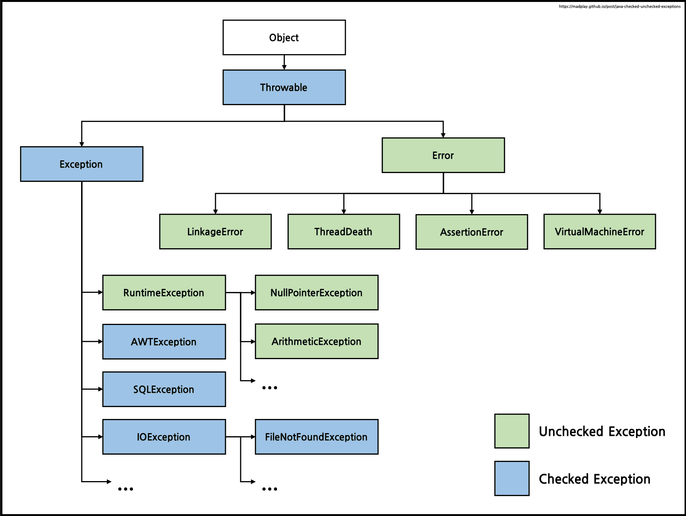

## Java의 Exception

### 질문
**1. 자바에서 Exception이 무엇인지 설명하고, Exception 처리를 위해 사용할 수 있는 방법들에 대해 언급해주세요.**

    자바에서 Exception은 사용자의 잘못된 조작이나 개발자의 코딩 실수로 인해 발생하는 프로그램 오류입니다. 
    Exception은 예외 처리를 통해 프로그램을 종료하지 않고 정상 실행 상태를 유지할 수 있습니다.
    예외 처리 방법으로는 'try-catch문`을 통해 try 내부에 비즈니스 로직을 구현하고, catch에 발생할 수 있는 예외를 처리하는 로직을 작성할 수 있습니다. 
    또 `throws`를 통해 자신을 호출한 대상이 예외를 처리하도록 떠넘길 수 있습니다.

**2. try-catch-finally 블록을 활용하여 예외 처리를 하는 방법에 대해 자세히 설명해보세요.**

    try-catch-finally 블록에서 try문 내의 로직에서 예외가 발생하지 않는다면, catch문을 확인하지 않고 finally 블록을 실행한 후 빠져나갑니다. 
    catch 문은 try문에서 발생할 수 있는 예외의 종류와 매개변수를 선언하여 해당 예외를 처리하는데, 
    첫 번째 catch 블록부터 차례대로 instanceOf로 예외 일치 여부를 확인합니다. 
    해당하는 예외를 찾았다면 해당 예외 클래스의 인스턴스가 생성되고, 예외를 처리한 후 finally 블록을 실행한 후 빠져나갑니다.

**3. Checked Exception과 Unchecked Exception의 차이점은 무엇인가요?**

    Checked Exception과 Unchecked Exception의 차이점은 '예외 처리의 강제성 여부`입니다. 
    Checked Exception은 Exception 하위 클래스 중 Runtime Exception을 제외한 모든 하위 클래스를 말하고, `try-catch`문을 통해 예외 처리가 강제됩니다. 
    반면에 Unchecked Exception은 Runtime Exception을 상속하는 하위 클래스를 발하고 예외 처리를 하지 않아도 코드를 실행할 수 있습니다.

**4. Checked Exception의 경우 왜 컴파일 단계에서 처리를 강제할까요? Checked Exception을 처리하는 방법 중 하나인 throws 키워드에 대한 자세한 설명을 해보세요.**

    Checked Exception을 컴파일 단계에서 처리를 강제하는 이유는 "안정성 확보" 때문입니다. 
    Checked Exception의 경우 주로 외부 자원이나 환경과 상호작용할 때 발생할 수 있는 예외입니다.
    그래서 외부 요인에 의한 예외를 명시적으로 처리하도록 강제하여 프로그램의 안정성을 높이기 위한 것입니다.

    throws 키워드는 메서드가 Checked Exception을 호출자에게 던질 가능성을 명시합니다.
    메서드의 선언부에 사용되며, 던질 수 있는 예외 타입을 쉼표로 구분하여 나열합니다. 또 나열된 예외는 모두 Checked Exception이어야 합니다.
    호출자는 해당 메서드 내에서 예외를 처리하거나 다시 예외를 넘길 수 있습니다.

<br>

### 예외란?
자바에서 예외란 사용자의 잘못된 조작이나 개발자의 코딩 실수로 인해 발생하는 프로그램 오류.

예외가 발생되면 프로그램은 곧바로 종료된다는 점에서 에러와 동일하지만,
예외는 예외 처리를 통해 프로그램을 종료하지 않고 정상 실행 상태를 유지할 수 있음.

<br>

### 에러와 예외 (Error & Exception)
프로그램 실행 시 발생할 수 있는 모든 문제들을 에러라 부르기도 하지만,
엄밀히 말하면 에러와 예외는 차이가 있음.

- 에러 (Error) : 한 번 발생하면 복구하기 어려운 수준의 심각한 문제를 의미하고, 대표적으로 OutOfMemory와 StackOverFlow가 있음.
- 예외 (Exception) : 개발자의 잘못된 사용으로 인해 발생하는 에러는 상대적으로 약한 문제 수준을 말함. 즉, 개발자의 실수로 인해 발생하는 것임.

<br>

### 예외 클래스의 상속 계층도


Java에서 모든 에러와 예외 클래스는 `Throwable` 클래스로부터 확장되며,
모든 예외의 상위 클래스는 `Exception` 클래스임.

또한 Exception 클래스는 `Runtime Exception`과 `Other Exception`으로 구분되고,
Runtime Exception은 `Unchecked Exception`, Other Exception은 `Checked Exception`라고 부름.

<br>

**미확인 예외 (Unchecked Exception)**

- 런타임 환경에서 발생하는 Exception
- 컴파일 과정에서는 해당 Exception을 인지할 수 없고, 코드가 런타임 환경에서 실행되는 과정에서 Exception이 발생함.
- Exception을 체크하지 않아도 코드를 실행시킬 수 있기 때문에 UncheckedException.
- ex. ClassCastException, ArrayIndexOutOfBoundException, NullPointerException 등

**실행 예외 클래스 (Runtime Exception)**

- 컴파일 타임에 발생 가능한 예외를 컴파일러가 확인하는 Exception
- 다만, Unchecked Exception과 차이는 `try-catch`문을 통한 예외 처리가 강제됨.
- ex. FileNotFoundException

<br>

### 예외 처리
**1. try-catch 문을 통한 예외처리**
- `try` 내부에 비즈니스 로직을 구현하고, `catch`에 발생할 수 있는 예외를 정의하고 예외 발생 시 어떤 동작을 할지 구현함.
- 예외가 발생하던 안하던 반드시 수행해야 하는 동작은 `finally`에 정의함.

**2. throws를 통한 예외처리**
- `throws`는 이 예외가 발생한 객체가 아닌 자신을 호출한 대상이 예외를 처리하도록 떠넘김.
- `CheckedException`들은 반드시 어딘가에서 해결해 주어야 함.

<br>

### 사용자 정의 예외
사용자 정의 예외 클래스란 개발자가 직접 정의하여 만드는 예외를 말함.

일반 예외(Checked Exception)의 경우 `Exception`을 상속하면 되고, 
런타임 예외(Unchecked Exception)의 경우 `RuntimeException`을 상속하면 됨.

```java
class AccountException extends Exception {
    public AccountException(String message) {
        super(message);
    }
}

class Account {
    int balance = 100;
    public void withdraw(int money) throws AccountException {
        if (balance < money) {
            throw new AccountException();
        }
        balance -= money;
    }
}

public static void main(String[] args) {
    Account account = new Account();
    try {
        account.withdraw(30_000);
    } catch (AccountException e) {
        String message = e.getMessage();
        System.out.println(message);
    }
}
```
